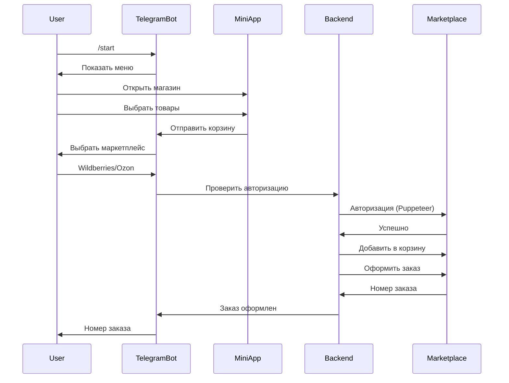

# E-commerce Bot Platform

## 🛍 Описание проекта

Платформа для автоматизации покупок на маркетплейсах Wildberries и Ozon через Telegram-бота. Система позволяет пользователям выбирать товары через удобный интерфейс Mini App, а затем автоматически оформлять заказы на маркетплейсах.

## 🎯 Основные возможности

- **Telegram Mini App** - удобный интерфейс для просмотра и выбора товаров
- **Автоматическая авторизация** на маркетплейсах через Selenium/Puppeteer
- **Оформление заказов** - бот добавляет товары в корзину и оформляет заказ
- **Отслеживание заказов** - сохранение и мониторинг статусов заказов
- **Бонусная система** - для блогеров и покупателей (в разработке)
- **Мультимаркетплейс** - поддержка Wildberries и Ozon

## 🏗 Архитектура

```
project/
├── src/                    # Frontend (React + TypeScript)
│   ├── components/         # UI компоненты
│   │   ├── MiniApp.tsx    # Основной компонент Mini App
│   │   └── MiniAppRoute.tsx # Роутинг и логика Mini App
│   └── lib/               # Утилиты и интеграции
│
├── bot-backend/           # Backend для Telegram-бота
│   ├── src/
│   │   ├── controllers/   # Обработчики команд бота
│   │   ├── services/      # Бизнес-логика
│   │   ├── types/         # TypeScript типы
│   │   └── utils/         # Вспомогательные функции
│   └── schema.sql         # Схема базы данных
│
└── supabase/              # Конфигурация Supabase
```

## 🚀 Установка и запуск

### Предварительные требования

- Node.js 18+
- npm или yarn
- Supabase аккаунт
- Telegram Bot Token (получить у @BotFather)

### 1. Клонирование репозитория

```bash
git clone [your-repo-url]
cd project
```

### 2. Установка зависимостей

#### Frontend
```bash
npm install
```

#### Backend
```bash
cd bot-backend
npm install
```

### 3. Настройка окружения

#### Frontend (.env)
```env
VITE_SUPABASE_URL=your_supabase_url
VITE_SUPABASE_ANON_KEY=your_supabase_anon_key
```

#### Backend (bot-backend/.env)
```env
TELEGRAM_BOT_TOKEN=your_bot_token
SUPABASE_URL=your_supabase_url
SUPABASE_ANON_KEY=your_supabase_anon_key
PORT=3001
MINIAPP_URL=http://localhost:5173
HEADLESS_BROWSER=false
```

### 4. Настройка базы данных

1. Создайте проект в Supabase
2. Выполните SQL из файла `bot-backend/schema.sql`
3. Настройте RLS политики при необходимости

### 5. Запуск проекта

#### Frontend
```bash
npm run dev
```

#### Backend
```bash
cd bot-backend
npm run dev
```

## 📱 Использование

### Для пользователей

1. Запустите бота командой `/start`
2. Нажмите "🛍 Open Store" для открытия магазина
3. Выберите товары и добавьте в корзину
4. Нажмите "Оформить заказ"
5. Выберите маркетплейс (Wildberries или Ozon)
6. При первом использовании привяжите аккаунт:
   - Нажмите "Link Accounts"
   - Введите номер телефона/email
   - Введите код подтверждения
7. Бот автоматически оформит заказ

### Для администраторов

1. Добавляйте товары через админ-панель
2. Отслеживайте заказы в разделе "Orders"
3. Управляйте пользователями и их правами

## 🔧 Технологии

### Frontend
- React 18
- TypeScript
- Tailwind CSS
- Vite
- Supabase Client

### Backend
- Node.js
- TypeScript
- Puppeteer (браузерная автоматизация)
- node-telegram-bot-api
- Express.js
- Supabase

## 🔒 Безопасность

- Не храним пароли пользователей
- Используем переменные окружения для чувствительных данных
- SSL/TLS для всех соединений
- RLS политики в Supabase для защиты данных

## 📊 Схема работы




